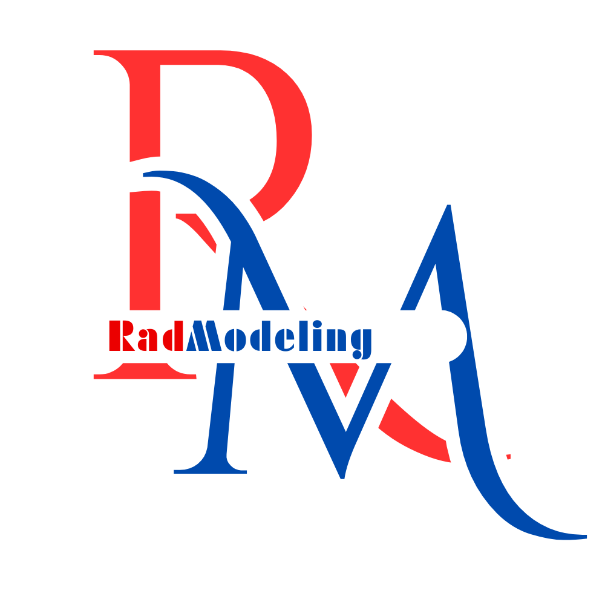

 
# SCtools

SCtools is a collection of several scripts. Many of them are written in IronPython and can 
be imported directly into SpaceClaim. Other scripts are meant to be run with CPython. 
Please refer to the documentation of each tool to understand how to use it.

Please take a look at the online documentation in [here](https://www.google.com/).

<video width="90%" max-width="1080px" controls autoplay loop muted>
  <source src="docs/source/_static/SpaceClaim_adjust_volume.mp4" type="video/mp4">
  Your browser does not support the video tag.
</video>

## List of tools

* `CSV workflow`. A set of scripts that greatly streamline and 
  facilitate the CAD to MCNP process.

  * `Prepare CAD`. Prepares the CAD model for the 
    workflow. It makes all the components independent of each other and assigns a to 
    each a unique ID.
  * `CSV generator`. Generates or updates the CSV file
    that contains all the information of the model as read by SpaceClaim.
  * `Detect volumes to adjust`. Highlights 
    the components that exceed the maximum volume deviation after simplification.
  * `Adjust volume`. Automatically extrudes the
    selected faces of a component to match the original volume of the component.
  * `Show by material`. Display only the components
    made of a selected list of materials.
  * `Save STEP`. Saves the CAD model as a STEP file
    in a way that the MCNP cell IDs will match the order of the CAD components.
  * `MCNP materials from CSV`. Updates the
    MCNP file with the materials, densities, density correction factors and component 
    names from the CSV file.

* `CAD to MCNP comparison`. This tool compares the 
  geometry of a CAD file in SpaceClaim with the geometry of the MCNP input file 
  generated from it. It can be used to check that the geometry in the CAD file is
  correctly translated to the MCNP input file.

* `Miscellaneous`. Set of one-off scripts that perform an 
  independent task.

  * `Elbow to cylinder`. Converts the toroidal elbows typically
    found in pipes in a set of cylinders.
  * `Detect torus`. Highlights all the bodies that 
    contain a toroidal surface.
  * `FMESH tally generator`. Generates a 
    FMESH tally card for MCNP from an arbitrarily sized and place SpaceClaim prismatic 
    body.
  * `Load CSV points`. Generates a set of points 
    in SpaceClaim from a CSV file. Synergizes with F4Enix lost particles features.
  * `Simplify toroidal profiles`. Simplifies the toroidal profile of a body 
    substituing the curves of its section with straight lines with a given angle between
    them.

* `Legacy`. Set of scripts that are either obsolete or outdated but may be useful
  in an future update.

  * `Report generation`. Automatically generates a 
    report with images and information of each component.
  * `Piping from CSV`. Generates a set of pipes from information read from a CSV 
    file. 

## License
Copyright 2019 F4E | European Joint Undertaking for ITER and the Development of Fusion Energy (‘Fusion for Energy’). Licensed under the EUPL, Version 1.1 or - as soon they will be approved by the European Commission - subsequent versions of the EUPL (the “Licence”). You may not use this work except in compliance with the Licence. You may obtain a copy of the Licence at: http://ec.europa.eu/idabc/eupl.html   
Unless required by applicable law or agreed to in writing, software distributed under the Licence is distributed on an “AS IS” basis, WITHOUT WARRANTIES OR CONDITIONS OF ANY KIND, either express or implied. See the Licence permissions and limitations under the Licence.
